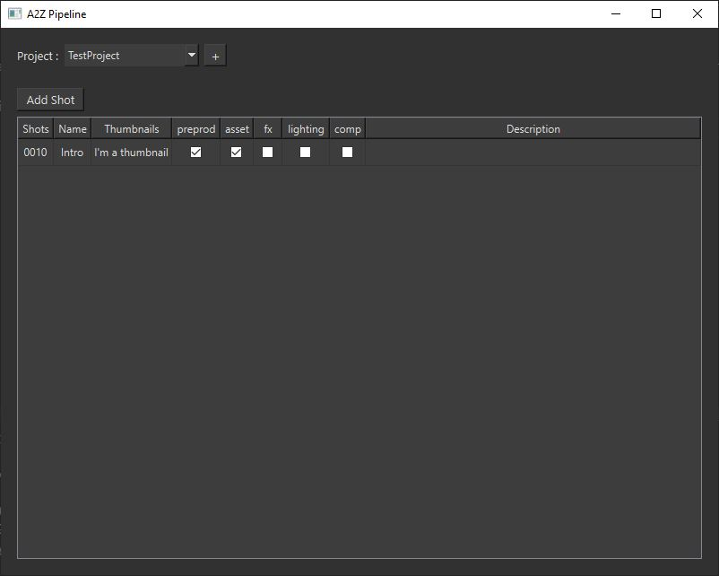

# A2Z Pipeline for VFX Production

**A2Z Pipeline** is a pipeline tool that can be used to manage files and directories directly from VFX software such as **Maya**, **Mari** or **Nuke** or via the **Standalone** app.

## StandAlone App

Using the **Standalone** app, you can create a new **project** using the **+** button, you can add shots to the selected project, name it, give a number and then check the departments that are done.

## Maya Plugin

### Save

If the current maya scene is **not** saved, it will open an **A2Z SaveAs window**. Using this window, you can choose the **project**, the **shot**, the **department** and the **type** of scene.
You can choose to **publish** the scene, that will save your scene into a publish folder.   
You can also add a thumbnail to the scene, using the **Screenshot** button to take a screenshot of your current view in maya or using the **Browse** button to choose an image in your file explorer.  

If the current maya scene is already saved, it will open an **A2Z Save window**. Using this window, you can choose the scene version, it will automatically increment by one at default.
You can add a new thumbnail the same way as for the saveas window and publish the scene.

### Open

To **open** a scene, you can use the **A2Z Open Window**. In this window, you can select the **project**, the **department**, the **shot** and the **type** of the scene. Next you will have a **dropdown** of all available scenes in the desired folder (it will automatically select the last scene).
When you select a scene, you will see the saved **thumbnail** on the left and the **path** on the bottom. 
Once you selected the desired scene, you can open the raw scene or import it **as reference**. 

### Export

For exporting assets, you can use the **A2Z ExportMesh Window**. In this window, you can select the **project**, the **department**, the **shot** and the **type** of the mesh. 
Below you can **name it** and choose the **file extension**.
You just have to choose if you want to **export selection** by using the checkbox.

### Render

For rendering, you can use the **A2Z Render Window**. In this window, you can select the **project**, the **shot** and the **type** of the render.
You can also **name** the render.
It will render using the render settings of the maya scene.
Using the **Animation** type, it will produce a playblast of the scene. 

## Mari Plugin

### Import

For importing a mesh in Mari, you can use the **A2Z Import Script**. In this window, you can select the **project** and the **shot**.
Below you will have a **dropdown menu** of all the **meshes** that correspond to the selected shot.
You can next use the **import button**.

### Export

For exporting a mesh in Mari, you can use the **A2Z Export Script**. In this window, you can select the **project** and the **shot**.
You can **name** the mesh, the exported textures will herit of this name.
You will have a **list** of all textures that can be exported, foreach textures you can select the **resolution**, the **colorspace** and the **depth**, you can also let as default (same as source).
You can next use the **export button**.

